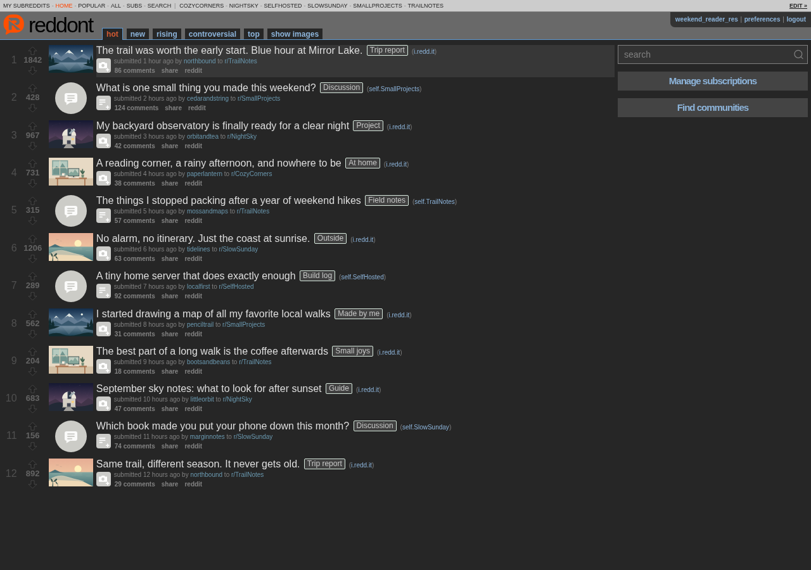
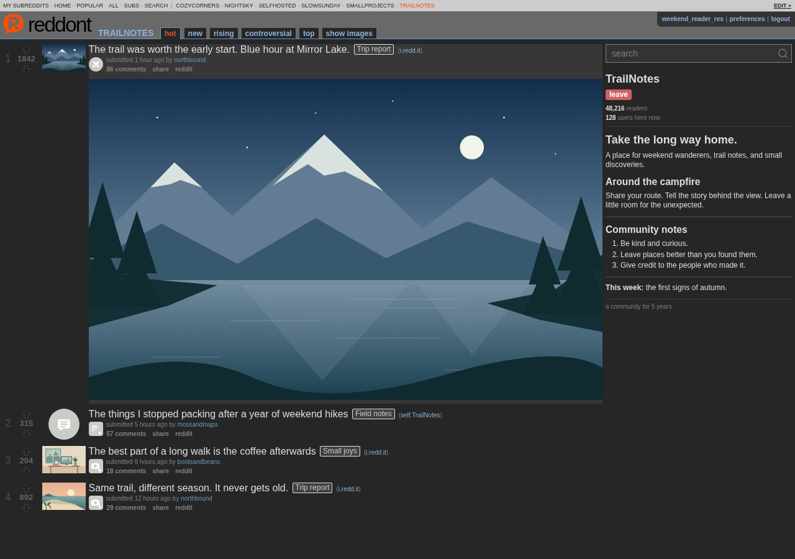
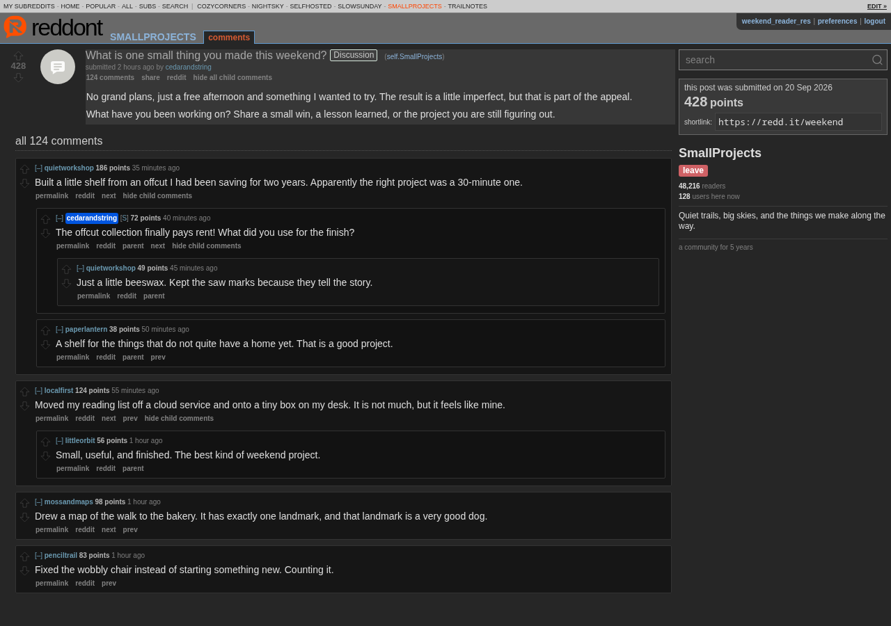
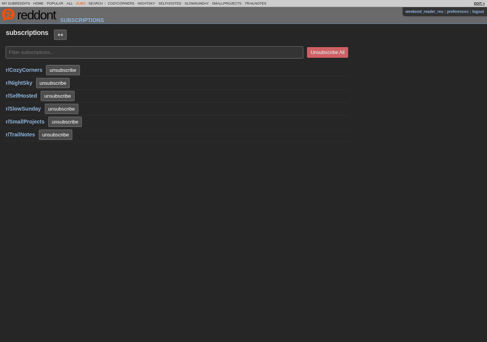
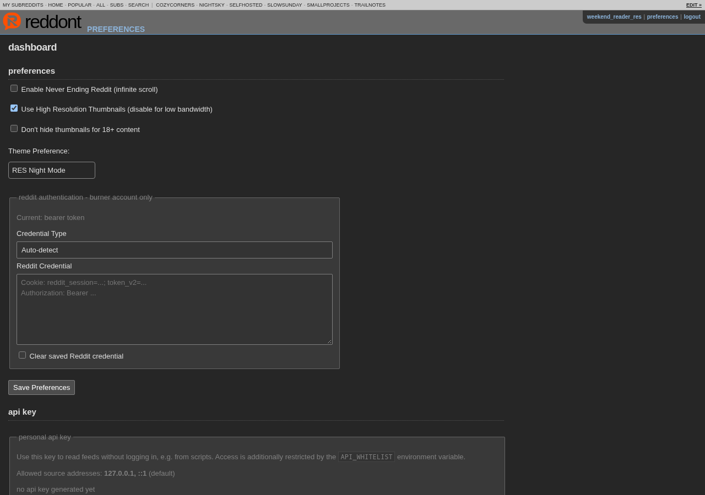
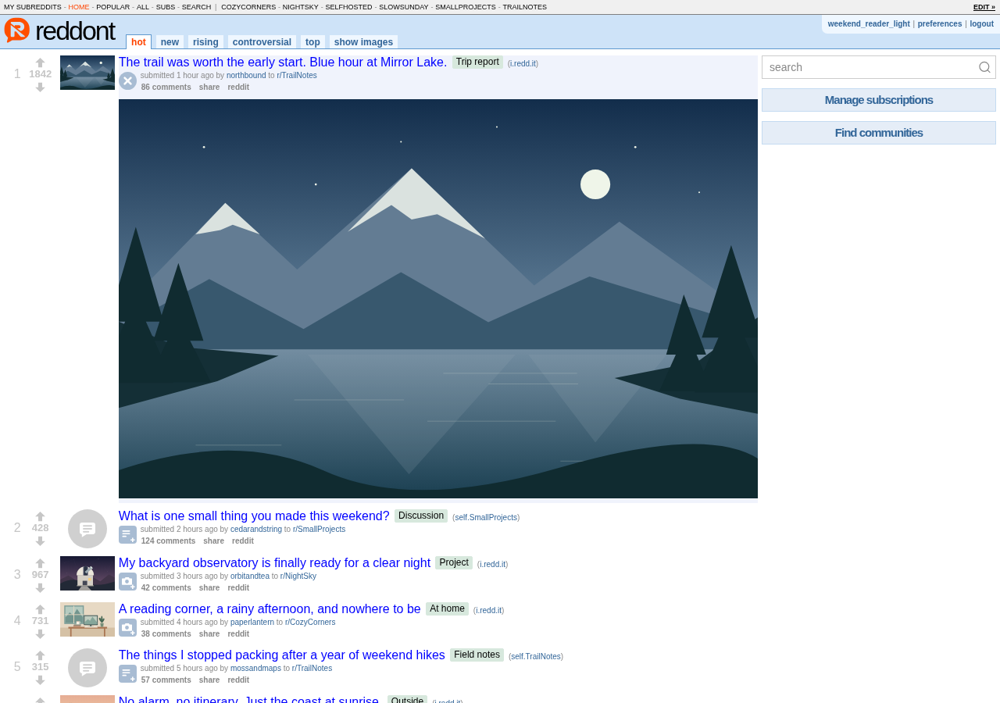
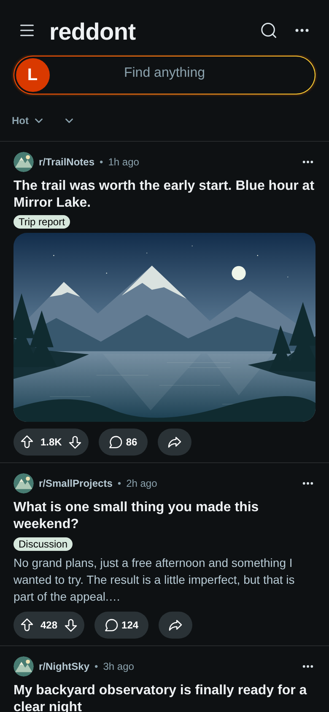
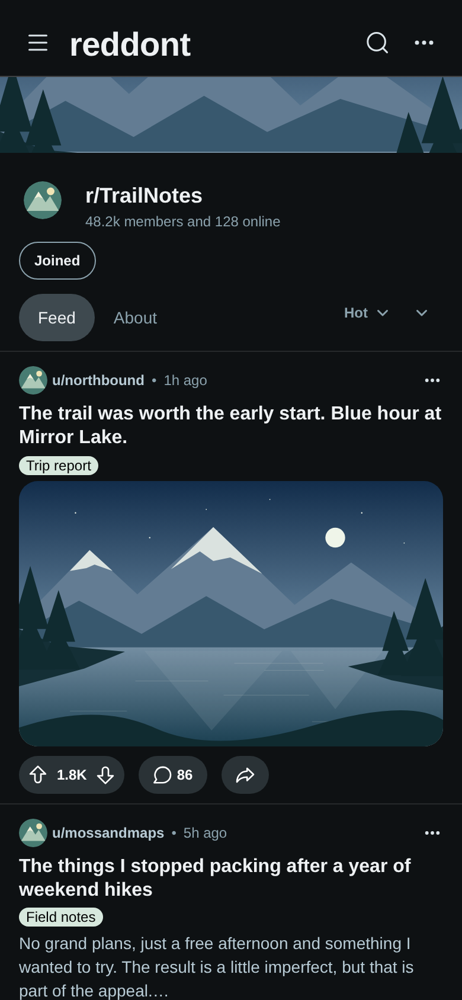
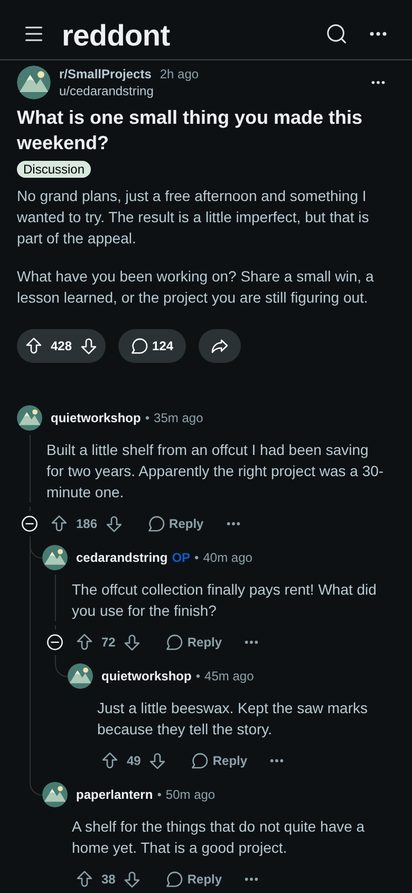
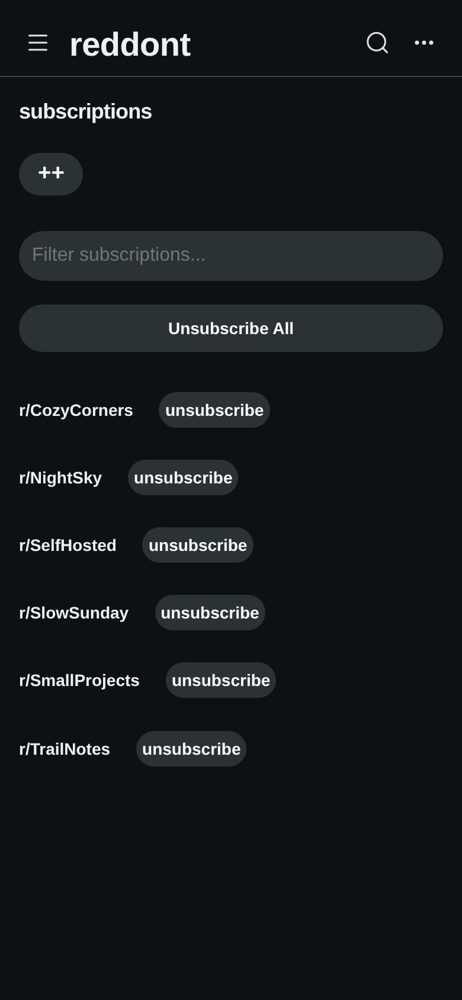

# Gallery

reddont on desktop and on a phone, with fictional posts, accounts, and illustrations. Select a screenshot to open it full size; use the arrow keys or buttons to move through the gallery.

## Desktop

<figure markdown="span">
[{ width="1280" height="900" loading="lazy" }](assets/screenshots/desktop-home.png)
<figcaption>Your subscriptions in one compact feed</figcaption>
</figure>

<figure markdown="span">
[{ width="1280" height="900" loading="lazy" }](assets/screenshots/desktop-community.png)
<figcaption>Community details and media opened in place</figcaption>
</figure>

<figure markdown="span">
[{ width="1280" height="900" loading="lazy" }](assets/screenshots/desktop-comments.png)
<figcaption>Threaded discussions with collapsible replies</figcaption>
</figure>

<figure markdown="span">
[{ width="1280" height="900" loading="lazy" }](assets/screenshots/desktop-subscriptions.png)
<figcaption>Manage the communities in your home feed</figcaption>
</figure>

<figure markdown="span">
[{ width="1280" height="900" loading="lazy" }](assets/screenshots/desktop-preferences.png)
<figcaption>Reading preferences for each account</figcaption>
</figure>

<figure markdown="span">
[{ width="1280" height="900" loading="lazy" }](assets/screenshots/desktop-light.png)
<figcaption>A light theme for daytime reading</figcaption>
</figure>

## Mobile

<figure markdown="span">
[{ width="780" height="1688" loading="lazy" }](assets/screenshots/phone-home.png)
<figcaption>Card view on a phone</figcaption>
</figure>

<figure markdown="span">
[{ width="780" height="1688" loading="lazy" }](assets/screenshots/phone-community.png)
<figcaption>Community browsing</figcaption>
</figure>

<figure markdown="span">
[{ width="780" height="1688" loading="lazy" }](assets/screenshots/phone-comments.png)
<figcaption>Follow a conversation on a smaller screen</figcaption>
</figure>

<figure markdown="span">
[{ width="780" height="1688" loading="lazy" }](assets/screenshots/phone-subscriptions.png)
<figcaption>Your subscriptions, wherever you read</figcaption>
</figure>

See [browsing](usage/browsing.md) and [preferences](usage/preferences.md) for these controls, or the [quick start](getting-started/quick-start.md) to run your own instance.
