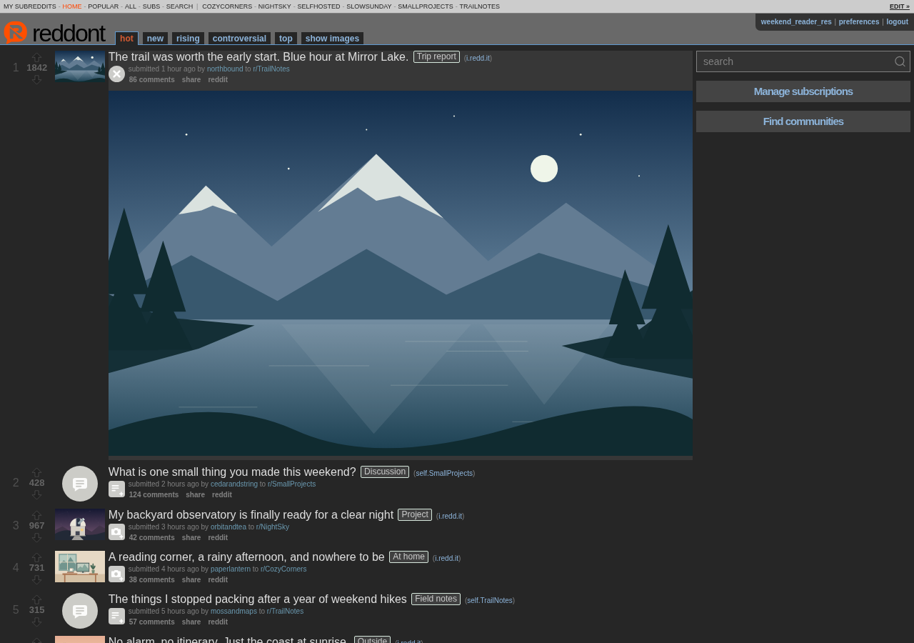

<h1>
  
  reddont
</h1>

[](LICENSE)
[](https://hub.docker.com/r/voc0der/reddont/tags)
[](https://github.com/voc0der/reddont/actions/workflows/publish-docker.yml)
[](docs/development/coverage.md)
[](https://github.com/voc0der/reddont/issues)
[](https://hub.docker.com/r/voc0der/reddont)
[](https://hub.docker.com/r/voc0der/reddont)

Read-only reddit from a web app you host yourself. The compact desktop layout draws inspiration from classic Reddit and RES, with a separate layout for phones. Follow communities, expand media inline, and browse threaded discussions with your own themes and reading preferences. Each person gets their own subscriptions, with invite-only accounts and optional single sign-on. JSON and Atom feeds connect your reading to other tools. See the [full feature list](https://voc0der.github.io/reddont/features/).

**[Documentation](https://voc0der.github.io/reddont/)** · [Quick start](https://voc0der.github.io/reddont/getting-started/quick-start/) · [Configuration](https://voc0der.github.io/reddont/reference/environment/) · [API reference](https://voc0der.github.io/reddont/reference/api/)

<hr>


<br>
<sub>More screenshots in the <a href="https://voc0der.github.io/reddont/gallery/">gallery</a>. Shown with fictional content.</sub>

## Setup

### Docker Compose

```sh
curl -fL https://raw.githubusercontent.com/voc0der/reddont/main/docker-compose.yaml -o docker-compose.yaml
docker compose up -d
```

> [!NOTE]
> Follow the [quick start](https://voc0der.github.io/reddont/getting-started/quick-start/) for configuration and first-time setup.

## Contributing

Issues and pull requests for bugs or improvements are welcome. Review the [development guide](https://voc0der.github.io/reddont/development/) before making changes. Release history is in the [changelog](CHANGELOG.md).

## License

[MIT](LICENSE). Based on [Akshay Oppiliappan](https://github.com/oppiliappan)'s Reddit client, with thanks for their work.
