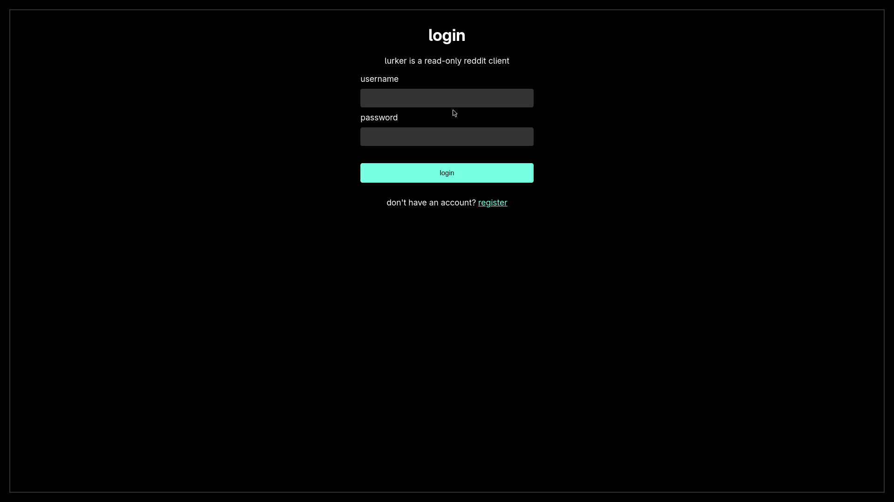
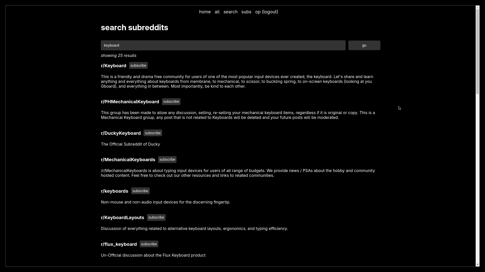
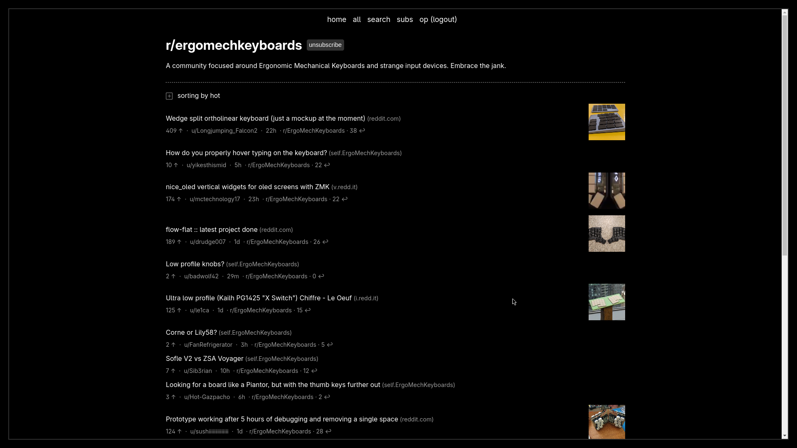
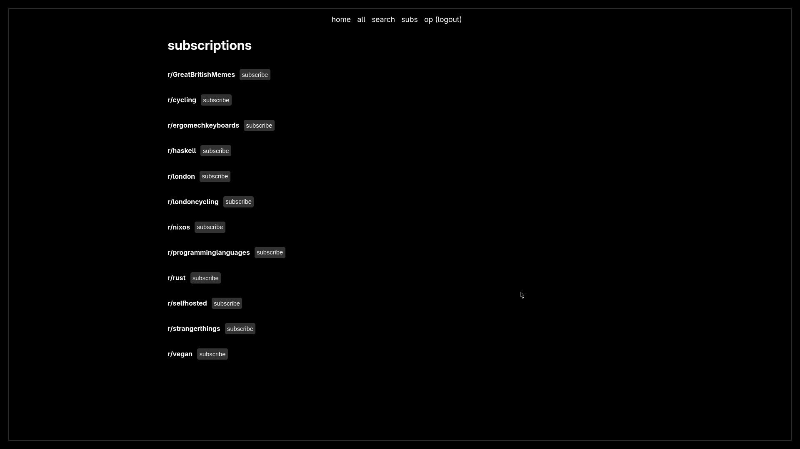
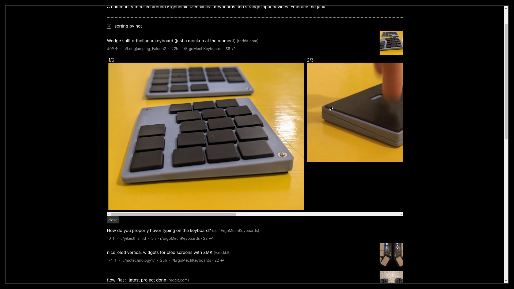
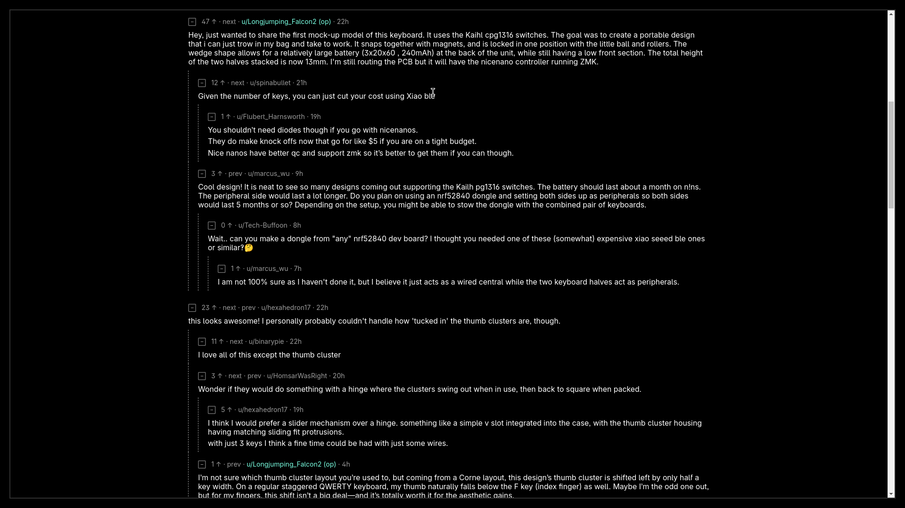
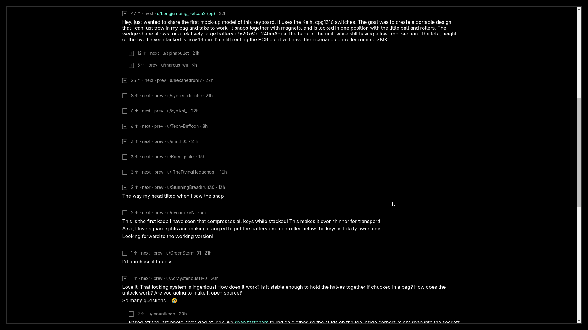
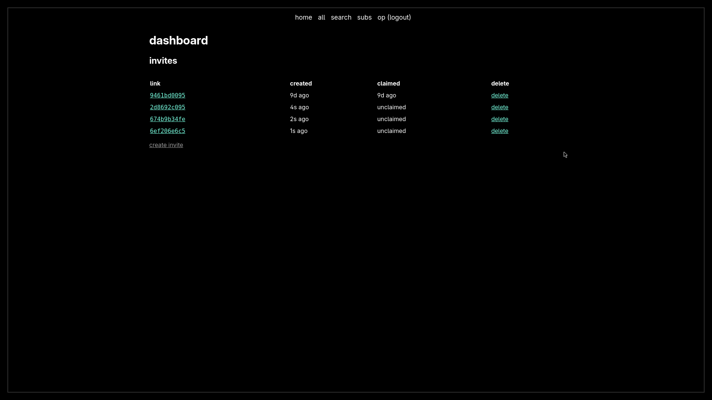
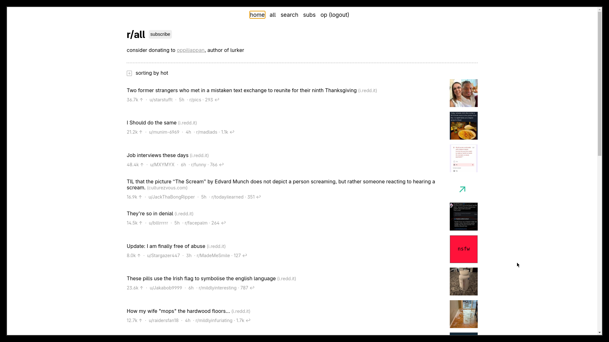

### reddont

Version 0.1.0.

reddont is a selfhostable, privacy-focused reddit client with SSO support,
user preferences, and PWA capabilities. it is better than old-reddit because:

- it renders well on mobile with responsive layouts
- it respects `prefers-color-scheme` with multiple theme options
- no account necessary to subscribe to subreddits
- no account necessary for over-18 content
- installable as a Progressive Web App (PWA)
- customizable per-user experience (infinite scroll, layout, themes)

i host a version for myself and a few friends. reach out to
me if you would like an invite.

### features

- **authentication & security**
  - SSO via Remote Header Authorization (Authelia, Authentik, etc.)
  - invite-only user management
  - admin dashboard with invite tokens
  - rate limiting and reverse proxy support
  - per-user API keys for scripted access, IP-gated and localhost-only by default

- **user experience**
  - minimal use of client-side javascript
  - account-based subscription system
  - per-user preferences (infinite scroll, theme, layout, thumbnail quality)
  - "Never Ending Reddit" infinite scroll option
  - Classic RES-style compact layout for desktop
  - multiple themes: auto (system), light, dark, RES night mode
  - high-resolution thumbnails (RES-quality, with low-bandwidth option)
  - Progressive Web App (PWA) - installable on mobile devices

- **content & navigation**
  - quick access to /r/all and /r/popular from navigation
  - pagination with infinite scroll option
  - comment collapsing, jump-to-next/prev comment
  - crosspost support
  - "search on undelete" url for deleted comments
  - over-18, spoiler images are hidden by default
  - inline post thumbnail expansion

i use reddont daily, and above features are pretty good for
my use.

### gallery

|  |       |  |
| ------------------------- | -------------------------------- | --------------------------------- |
| login                     | search                           | subreddit view                    |

|    |     |    |
| ------------------------- | -------------------------------- | --------------------------------- |
| subscriptions page        | inline post thumbnail expand     | comments view                     |

|  |       |   |  |
| ------------------------------- | -------------------------------- | -------------------------- | --------------------------- |
| collapse comments               | admin dashboard & invites table  | light mode                 | mobile optimized page       |

### setup

you can run reddont as a systemd service on nixos:

```nix
inputs.reddont.url= "git+https://github.com/voc0der/reddont";
  .
  .
  .
services.reddont = {
  enable = true;
  port = 9495;
};
```

or with the docker image:

```bash
# pull the latest image from gh container registry
$ docker pull ghcr.io/voc0der/reddont:latest

REPOSITORY                   TAG       IMAGE ID       CREATED        SIZE
ghcr.io/voc0der/reddont   latest    ba3733164889   ???            227MB

# start reddont in a container
#
# reddont stores data in /data,
# so create a volume on the host accordingly:
$ docker run -v /your/host/reddont-data:/data -p 3000 ghcr.io/voc0der/reddont:latest
```

or with docker compose:

```yaml
---
services:
  reddont:
    image: ghcr.io/voc0der/reddont:latest
    container_name: reddont
    environment:
      - PUID=1000              # user ID for file permissions
      - PGID=1000              # group ID for file permissions
      - REDDONT_PORT=3000
      - LOG_LEVEL=info         # debug, info, warn, or error
      # - REMOTE_HEADER_LOGIN=true  # uncomment for SSO
      # - ADMIN_GROUP=admin         # SSO admin group name
    volumes:
      - /your/host/reddont-data:/data
    ports:
      - "3000:3000"
    restart: unless-stopped
```

See `docker-compose.yaml` for a full compose example with **all** environment variables (and their defaults).


or with just [bun](https://bun.sh/):

```bash
bun run src/index.js
```

### usage

the instance is open to registrations when first started.
you can head to /register and create an account. this
account will be an admin account. you can click on your
username at the top-right to view the dashboard and to
invite other users to your instance. copy the link and send
it to your friends!

**user preferences**

each user can customize their experience via the dashboard:
- **Never Ending Reddit**: enable infinite scroll instead of pagination
- **Classic RES-style Layout**: toggle compact desktop layout (thumbnails on left)
- **High Resolution Thumbnails**: use RES-quality preview images (640x640+) instead of low-res thumbnails (70x70), can be disabled for low bandwidth connections
- **Theme Preference**: choose between auto (system), light, dark, or RES night mode
- **Reddit Authentication**: optionally send a per-user Reddit bearer token or cookie header with Reddit JSON requests

**api access**

each user can mint a personal API key from the dashboard ("api key" section) to
read reddit through reddont without logging in — useful for scripts, feed
readers, and automations. requests are served with **that user's stored reddit
credential** (the burner-account bearer token or cookie set in the dashboard),
so your automation reuses the same authenticated session reddont uses instead of
hitting reddit anonymously and getting rate limited.

the API is locked down by two independent gates:

1. `API_WHITELIST` — the source address must be listed. it defaults to loopback
   only (`127.0.0.1,::1`), so a fresh install is reachable only from inside the
   container/host. it is compared against the direct TCP peer, never
   `X-Forwarded-For`
2. the per-user API key itself

pass the key as `X-API-Key`, `Authorization: Bearer <key>`, or `?api_key=`
(handy for feed readers; note keys in urls end up in access logs). regenerating
a key immediately invalidates the old one; revoking removes API access for that
user entirely.

```bash
# from a host allowed by API_WHITELIST (e.g. API_WHITELIST=10.2.5.50)
$ curl -k -H "X-API-Key: $REDDONT_KEY" \
    https://172.28.17.103:9495/api/v1/r/buildapcsales/new.rss

# same data as json
$ curl -k -H "X-API-Key: $REDDONT_KEY" \
    "https://172.28.17.103:9495/api/v1/r/buildapcsales/new.json?limit=50"
```

every endpoint below serves `.rss`/`.atom` (an atom feed shaped like reddit's
own `.rss`), `.json` (normalized fields), or `.json?raw=1` (reddit's untouched
listing json). a path with no extension defaults to json.

| endpoint | description |
| -------- | ----------- |
| `GET /api/v1/health` | whitelist probe; the only endpoint that needs no key |
| `GET /api/v1/whoami` | the user the key belongs to |
| `GET /api/v1/r/<sub>/<sort>` | listing for a subreddit; sort is `hot`, `new`, `top`, `best`, `rising`, or `controversial` |
| `GET /api/v1/r/<sub>` | same, sort via `?sort=` (default `hot`); multireddits work as `sub1+sub2` |
| `GET /api/v1/r/<sub>/about.json` | subreddit metadata |
| `GET /api/v1/home` | the key owner's subscription multireddit |
| `GET /api/v1/comments/<id>` | a submission and its comments, flattened |
| `GET /api/v1/search?q=...` | submission search, optionally `&subreddit=<sub>` |
| `GET /api/v1/subscriptions` | the key owner's subscribed subreddits |

query params: `limit` (1-100, default 25), `after`/`before` for paging, `t`
(`hour`…`all`) for `top`/`controversial`, and `raw=1`. anything else is dropped
rather than forwarded to reddit.

**PWA installation**

reddont can be installed as a Progressive Web App on mobile devices:
- **Android**: Open in Chrome → Menu (⋮) → "Install app" or "Add to Home screen"
- **iOS**: Open in Safari → Share (⬆) → "Add to Home Screen"

once installed, reddont runs in standalone mode without browser chrome.

### environment variables

**server configuration**
- `REDDONT_PORT`: port to listen on, defaults to `3000`
- `HTTP_BINDING`: IP address to bind to, defaults to `0.0.0.0`
- `REDDONT_SSL_CERT_PATH`: path to SSL certificate file for HTTPS
- `REDDONT_SSL_KEY_PATH`: path to SSL key file for HTTPS

**docker-specific**
- `PUID`: user ID for file permissions in Docker container, defaults to `1000`
- `PGID`: group ID for file permissions in Docker container, defaults to `1000`

**authentication & security**
- `JWT_SECRET_KEY`: secret key for JWT token signing (auto-generated if not set)
- `REMOTE_HEADER_LOGIN`: enable SSO via remote headers (`true`/`false`)
- `ADMIN_GROUP`: remote header group name that grants admin privileges, defaults to `admin`
- `REVERSE_PROXY_WHITELIST`: comma-separated list of trusted proxy IPs for `trust proxy` setting

**api**
- `API_WHITELIST`: comma-separated source addresses allowed to reach `/api/v1`.
  Defaults to `127.0.0.1,::1` (loopback only) when unset or empty. Accepts plain
  IPs and IPv4 CIDR ranges (`172.28.0.0/16`), `off` to disable the API entirely,
  or `*` to allow any address
- `API_RATE_LIMIT`: maximum API requests per 15-minute window per IP, defaults to `600`

**OIDC (OpenID Connect + PKCE)**
- `OIDC_ENABLED`: set to `true` to enable OIDC
- `OIDC_ISSUER_URL`: provider discovery URL (required)
- `OIDC_CLIENT_ID`: client ID (required)
- `OIDC_CLIENT_SECRET`: client secret (required)
- `OIDC_REDIRECT_URI`: callback URL (required, e.g. `https://reddont.example.com/auth/oidc/callback`)
- `OIDC_SCOPE`: scopes to request (default: `openid profile email`; add `offline_access` if your IdP requires it for refresh tokens)
- `OIDC_AUTO_REGISTER`: auto-create users on first OIDC login (default: `true`)
- `OIDC_ADMIN_CLAIM`: claim to use for admin mapping (default: `groups`)
- `OIDC_ADMIN_VALUE`: value in the admin claim that grants admin (default: `admin`)
- `OIDC_GROUP_CLAIM`: claim to read groups from and persist to the user record (default: `groups`)
- `OIDC_ALLOWED_GROUPS`: comma-separated list of groups required to log in / auto-register (optional)


**application settings**
- `REDDONT_THEME`: name of CSS theme file. The file must be present in `src/public`
- `LOG_LEVEL`: logging verbosity - `debug`, `info` (default), `warn`, or `error`
- `RATE_LIMIT`: maximum requests per 15-minute window per IP, defaults to `100`

### technical

reddont uses an sqlite db to store accounts, invites and subscriptions. it
creates `reddont.db` in `REDDONT_DATA_DIR` when set, otherwise in `/data` if that
directory exists, `$XDG_DATA_HOME/reddont`, or `~/.local/share/reddont`.

to hack on reddont:

```bash
nix shell .#        # get a devshell
nix build .#reddont  # build the thing
```

### todo

**completed features**
- [x] highlights for op, sticky etc.
- [x] open in reddit link
- [x] service worker for offline PWA support
- [x] subscription manager: bulk add, search/filter, unsubscribe all
- [x] support crossposts
- [x] PWA support (manifest, icons, meta tags)
- [x] user preferences system (infinite scroll, themes, layout)
- [x] per-user Reddit auth header support
- [x] "Never Ending Reddit" infinite scroll
- [x] Classic RES-style layout
- [x] multiple theme support (auto/light/dark/RES)
- [x] SSO via remote header authorization
- [x] collapse even singular comments
- [x] details tag on safari
- [x] expand/collapse comments
- [x] fix gallery thumbnails
- [x] fix spacing between comments
- [x] fix title rendering in views/comments.pug
- [x] pass query params into templates, add into pagination
- [x] placeholder for unresolvable thumbnails
- [x] set home to sum of subs
- [x] styles for info-containers
- [x] support 'more comments'

Based on [Akshay Oppiliappan](https://github.com/oppiliappan)'s Reddit client, with thanks for their work.
